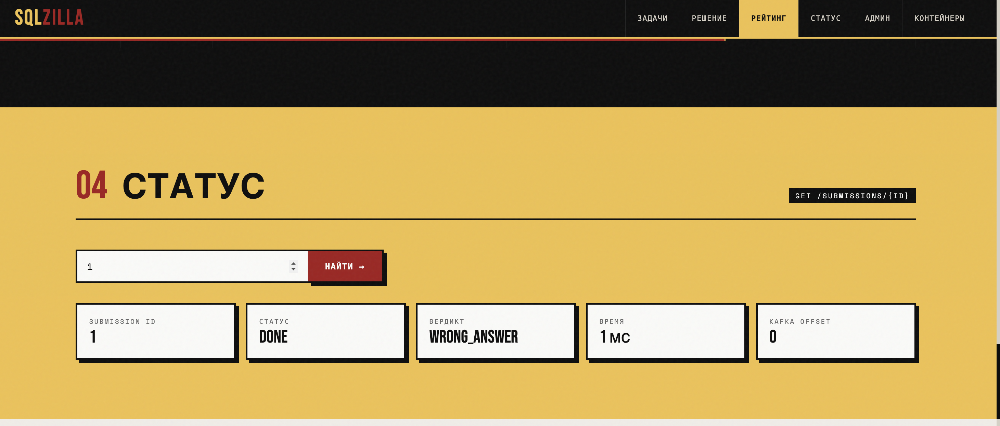
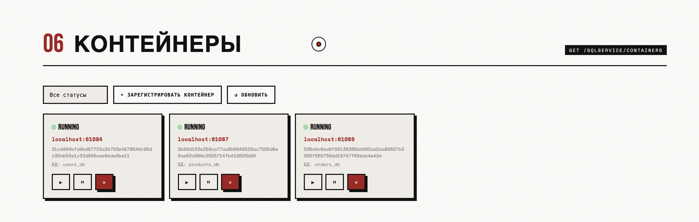

# 🧪 SqlService — сервис проверки SQL-запросов

> Отправь SQL-запрос, получи вердикт!  
> Автоматическая изоляция, кеширование эталонов и асинхронная очередь сообщений.

---

## О проекте

**SqlService** — это платформа для автоматической оценки SQL-запросов. Преподаватель создаёт задачу с правильным ответом, а студент отправляет своё решение. Сервис выполняет оба запроса в изолированных контейнерах PostgreSQL и выносит вердикт: `ACCEPTED`, `WRONG_ANSWER`, `COMPILATION_ERROR`, `RUNTIME_ERROR` или `TIME_LIMIT_EXCEEDED`.

Архитектура построена вокруг Apache Kafka: посылки попадают в очередь, обрабатываются асинхронно, а результат сохраняется в базе данных. Для каждой задачи динамически поднимается свежий контейнер с базой данных через Testcontainers, что гарантирует полную изоляцию и повторяемость проверок.

---

## Скриншоты

### Начальное окно 


### Список задач 


### Решение задач 


### Рейтинг submission


### статус посылки 


### Управление списком задач


### Управление контейнерами 


*(скриншоты можно добавить позже)*

---

## Технологический стек

| Слой | Технология |
|------|-----------|
| Backend | Java 25, Spring Boot 4 |
| ORM | Hibernate, Spring Data JPA |
| База данных (основная) | PostgreSQL 15 |
| Очередь сообщений | Apache Kafka + Zookeeper |
| Изоляция тестовых сред | Testcontainers (PostgreSQL in Docker) |
| Frontend | Thymeleaf + Vanilla JS |
| Контейнеризация инфраструктуры | Docker Compose |

---

## Функциональность

### Задачи (Tasks)
- Создание задачи с привязкой к одной из предустановленных схем базы данных (пресетов).
- Хранение эталонного SQL-запроса, таймлимита, описания и типа задачи (DQL, DML и др.).
- Редактирование и удаление задач.
- При удалении задачи автоматически инвалидируется кеш эталонного результата.

### Посылки (Submissions)
- Отправка решения через REST API с указанием `userId`, `taskId` и SQL-запроса.
- Асинхронная обработка: submission помещается в Kafka топик `sql.submissions`.
- Consumer выполняет эталонный запрос (с кешированием) и пользовательский запрос в свежем контейнере.
- Сравнение результатов по SHA-256 хешу → вердикт.
- Поллинг статуса посылки через `GET /submissions/{id}`.
- Гибкая фильтрация по задаче и пользователю.
- Таблица лидеров (`/leaderboard`): только `ACCEPTED`, упорядочено по времени поступления (kafka offset).

### Автоматическое управление контейнерами
- При старте приложения создаются контейнеры для трёх пресетов (`USERS`, `PRODUCTS`, `ORDERS`).
- Каждый контейнер инициализируется собственным SQL-скриптом (`users-init.sql`, …).
- Контейнеры эфемерные: при остановке приложения они удаляются, при запуске – поднимаются заново.
- Административный эндпоинт `POST /admin/containers/provision?preset=USERS` позволяет вручную пересоздать контейнер.

### Кеширование эталонных результатов
- Эталонный запрос выполняется один раз для задачи, результат сохраняется в `task_result_cache`.
- Хеш результата используется для быстрого сравнения с ответом пользователя.
- При изменении `correct_sql` задачи кеш автоматически сбрасывается.

### UI (опционально)
- Минималистичный SPA на Thymeleaf с формой отправки запроса и отображением статуса.

---

## Как запустить

### Требования
- Docker & Docker Compose
- Java 25+
- Gradle

### 1. Клонируй репозиторий
```bash
git clone git@github.com:yourname/SqlService.git
cd SqlService
```

### 2. Подними инфраструктуру (PostgreSQL + Kafka)
```bash
docker compose up -d
```
(Убедись, что файл `docker-compose.yml` содержит сервисы `postgres`, `kafka` и `zookeeper`.)

### 3. Запусти приложение
```bash
./gradlew bootRun
```

При первом запуске автоматически создадутся таблицы (`ddl-auto=update`) и поднимутся три тестовых контейнера PostgreSQL для пресетов.

### 4. Открой браузер
[http://localhost:8080](http://localhost:8080)

---

## API

### Admin
| Метод | Путь | Описание |
|-------|------|----------|
| `POST` | `/sqlservice/admin/containers/provision?preset=USERS` | Пересоздать контейнер для пресета |

### Tasks
| Метод | Путь | Описание |
|-------|------|----------|
| `POST` | `/sqlservice/tasks` | Создать задачу |
| `GET` | `/sqlservice/tasks` | Все задачи |
| `GET` | `/sqlservice/tasks?databaseId=1` | Задачи конкретной базы |
| `GET` | `/sqlservice/tasks/{id}` | Одна задача |
| `PATCH` | `/sqlservice/tasks/{id}` | Обновить поля (null игнорируются) |
| `DELETE` | `/sqlservice/tasks/{id}` | Удалить задачу и кеш |

### Submissions
| Метод | Путь | Описание |
|-------|------|----------|
| `POST` | `/sqlservice/submissions` | Отправить решение → `202 Accepted` |
| `GET` | `/sqlservice/submissions/{id}` | Статус посылки |
| `GET` | `/sqlservice/submissions?taskId=&userId=` | Список с фильтрами |
| `GET` | `/sqlservice/submissions/leaderboard?taskId=` | Рейтинг (Accepted, по времени) |

### Containers
| Метод | Путь | Описание |
|-------|------|----------|
| `POST` | `/sqlservice/containers` | Зарегистрировать контейнер вручную |
| `GET` | `/sqlservice/containers` | Все контейнеры |
| `GET` | `/sqlservice/containers?status=RUNNING` | Фильтр по статусу |
| `PATCH` | `/sqlservice/containers/{id}/status?value=PAUSED` | Изменить статус |
| `DELETE` | `/sqlservice/containers/{id}` | Удалить контейнер |

### Databases
| Метод | Путь | Описание |
|-------|------|----------|
| `POST` | `/sqlservice/databases` | Добавить описание базы |
| `GET` | `/sqlservice/databases` | Список баз |
| `GET` | `/sqlservice/databases/{id}` | Одна база |
| `DELETE` | `/sqlservice/databases/{id}` | Удалить из реестра |

### UI
| Метод | Путь | Описание |
|-------|------|----------|
| `GET` | `/` | Главная страница |
| `GET` | `/{path}` | SPA fallback (любой не-API путь) |

---

## Конфигурация

Основные параметры в `application.properties` ( так как у меня так называется):

```properties
spring.datasource.url=jdbc:postgresql://localhost:5433/sqlservice
spring.datasource.username=...
spring.datasource.password=...
spring.kafka.bootstrap-servers=localhost:9092
spring.jpa.open-in-view=false
```


---

## Разработка

### Добавление нового пресета
1. Создайте SQL-скрипт в `src/main/resources/init-scripts/`.
2. Добавьте элемент в enum `DatabasePreset` с указанием имени базы и пути к скрипту.
3. При следующем запуске контейнер поднимется автоматически.

### Тестирование
Пока модульные тесты отсутствуют (запланированы). Для ручной проверки используйте `curl` и сквозной сценарий создания задачи и отправки решения.

---
